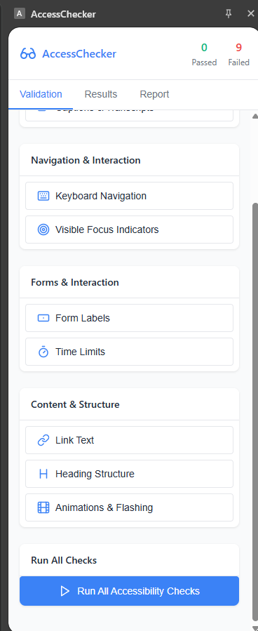

# AccessChecker

AccessChecker é uma extensão de navegador que ajuda desenvolvedores e designers a verificar e melhorar a acessibilidade de suas páginas web de forma simples e eficiente.

## Funcionalidades

A extensão oferece diversas verificações de acessibilidade, divididas nas seguintes categorias:

### Imagens e Mídia
- **Alt Text Check**: Verifica se as imagens possuem texto alternativo adequado
- **Captions & Transcripts**: Verifica a presença de legendas e transcrições para conteúdo audiovisual

### Navegação e Interação
- **Keyboard Navigation**: Verifica se os elementos interativos são acessíveis via teclado
- **Visible Focus Indicators**: Verifica a presença de indicadores visuais de foco durante navegação por teclado

### Formulários e Interação
- **Form Labels**: Verifica se campos de formulário possuem rótulos associados corretamente
- **Time Limits**: Verifica restrições de tempo que possam prejudicar a experiência de usuários

### Conteúdo e Estrutura
- **Link Text**: Verifica se os links possuem textos descritivos e significativos
- **Heading Structure**: Verifica a estrutura hierárquica de cabeçalhos
- **Animations & Flashing**: Verifica animações e conteúdos piscantes que possam causar problemas

## Como Usar

1. Instale a extensão no seu navegador
2. Navegue até a página que deseja analisar
3. Clique no ícone da extensão para abrir o painel lateral
4. Selecione verificações individuais ou execute todas as verificações de uma vez
5. Visualize os resultados na aba "Results"
6. Exporte relatórios detalhados na aba "Report"

## Painéis da Extensão

A extensão possui três abas principais:

- **Validation**: Interface para iniciar verificações de acessibilidade
- **Results**: Mostra os resultados detalhados das verificações realizadas
- **Report**: Fornece um relatório completo que pode ser exportado

## Requisitos Técnicos

- Compatible com navegadores baseados em Chromium (Google Chrome, Microsoft Edge, etc.)
- Utiliza Manifest V3 para extensões de navegador

## Desenvolvimento

Este projeto utiliza:
- JavaScript para a lógica da extensão
- HTML/CSS para a interface
- API de extensões do Chrome para comunicação entre contextos

### Estrutura do Projeto

- **manifest.json**: Configuração da extensão
- **background.js**: Script de fundo que gerencia a extensão
- **content.js**: Script injetado nas páginas para realizar as verificações de acessibilidade
- **popup.html/popup.js**: Interface popup inicial da extensão
- **sidepanel.html/sidepanel.js/sidepanel.css**: Interface do painel lateral principal

### Instalação para Desenvolvimento

1. Clone este repositório
2. Abra o Chrome/Edge e acesse `chrome://extensions` ou `edge://extensions`
3. Ative o "Modo de desenvolvedor"
4. Clique em "Carregar sem compactação" e selecione a pasta do projeto

## Limitações Atuais

- Algumas verificações podem exigir análise manual para confirmação
- A extensão atualmente funciona apenas em páginas já carregadas
- Não substitui testes de acessibilidade completos com usuários reais

## Melhores Práticas Recomendadas

AccessChecker é uma ferramenta para auxiliar no desenvolvimento e não substitui o conhecimento sobre as diretrizes WCAG (Web Content Accessibility Guidelines). Recomenda-se:

1. Usar a extensão como parte de um processo mais amplo de acessibilidade
2. Consultar as diretrizes WCAG para entendimento aprofundado
3. Realizar testes com usuários reais, incluindo pessoas com deficiências

## Contribuindo

Contribuições são bem-vindas! Sinta-se à vontade para abrir issues ou enviar pull requests.

## Licença

Este projeto está licenciado sob [incluir licença apropriada]. 